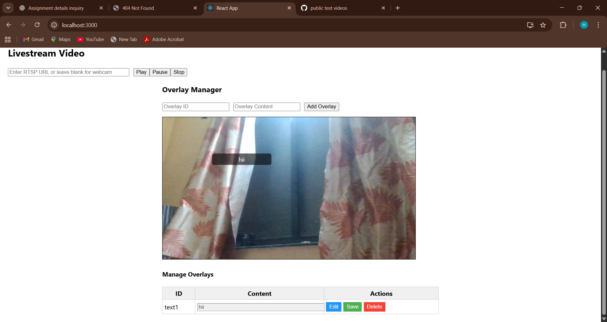

# fullstack_task


---

````markdown
# Full Stack Livestream Overlay App

This project is a **React + Flask + MongoDB** application that allows users to view a livestream (webcam or RTSP URL) and add customizable overlays. Users can create, read, update, and delete overlays with live positioning and resizing.

---

## **Tech Stack**
- Frontend: React
- Backend: Python Flask
- Database: MongoDB
- Video Streaming: OpenCV (supports RTSP or webcam)
- Overlay Drag & Resize: `react-rnd`

---

## **1️⃣ Backend Setup**

### **Requirements**
- Python 3.x
- MongoDB running locally
- Pip packages: `flask`, `flask-cors`, `pymongo`, `opencv-python`

### **Install Backend Dependencies**
```bash
pip install flask flask-cors pymongo opencv-python
````

### **Run Backend**

```bash
python server.py
```

* Flask server runs at: `http://localhost:5000`

---

## **2️⃣ Frontend Setup**

### **Requirements**

* Node.js & npm

### **Install Frontend Dependencies**

```bash
npm install axios react-rnd
```

### **Run Frontend**

```bash
npm start
```

* React app runs at: `http://localhost:3000`

---

## **3️⃣ Using the App**

### **Play Livestream**

1. Enter RTSP URL (or leave blank for webcam).
2. Click **Play** to start streaming.
3. **Pause** to pause stream, **Stop** to reset stream.

### **Add Overlay**

1. Enter **Overlay ID** and **Content**.
2. Click **Add Overlay**.
3. Overlay will appear on the livestream.
4. Drag and resize overlay as needed.

### **Manage Overlays**

| Button     | Action                                   |
| ---------- | ---------------------------------------- |
| **Edit**   | Enable inline editing of overlay content |
| **Save**   | Save changes to backend                  |
| **Delete** | Remove overlay from backend              |

---

## **4️⃣ API Documentation**

### **Base URL**

```
http://localhost:5000
```

### **1. Set RTSP URL**

* **POST** `/set_rtsp`
* **Request Body:**

```json
{
  "url": "rtsp://your_stream_url"
}
```

* **Response:**

```json
{ "message": "RTSP URL updated" }
```

### **2. Get All Overlays**

* **GET** `/overlays`
* **Response:**

```json
[
  {
    "overlay_id": "1",
    "content": "My Text",
    "x": 50,
    "y": 50,
    "width": 150,
    "height": 50
  }
]
```

### **3. Create Overlay**

* **POST** `/overlays`
* **Request Body:**

```json
{
  "overlay_id": "1",
  "content": "My Text",
  "x": 50,
  "y": 50,
  "width": 150,
  "height": 50
}
```

* **Response:**

```json
{ "message": "Overlay created" }
```

### **4. Update Overlay**

* **PUT** `/overlays/<overlay_id>`
* **Request Body:**

```json
{
  "content": "Updated Text",
  "x": 60,
  "y": 60,
  "width": 200,
  "height": 70
}
```

* **Response (success):**

```json
{ "message": "Updated successfully" }
```

* **Response (failure):**

```json
{ "error": "Overlay not found" }
```

### **5. Delete Overlay**

* **DELETE** `/overlays/<overlay_id>`
* **Response (success):**

```json
{ "message": "Deleted successfully" }
```

* **Response (failure):**

```json
{ "error": "Overlay not found" }
```

### **6. Video Feed**

* **GET** `/video_feed`
* MJPEG stream to embed in `` tag:

```html

```

---

## **5️⃣ Notes**

* Overlays are draggable and resizable on livestream.
* Positions and sizes are stored in MongoDB.
* The app automatically fetches all overlays on page load.

---

## **6️⃣ Screenshots**

> Add screenshots here:


## Livestream Video Preview




---

## **7️⃣ Commands Summary**

```bash
# Backend
pip install flask flask-cors pymongo opencv-python
python server.py

# Frontend
npm install
npm install axios react-rnd
npm start
```

---

```

---


